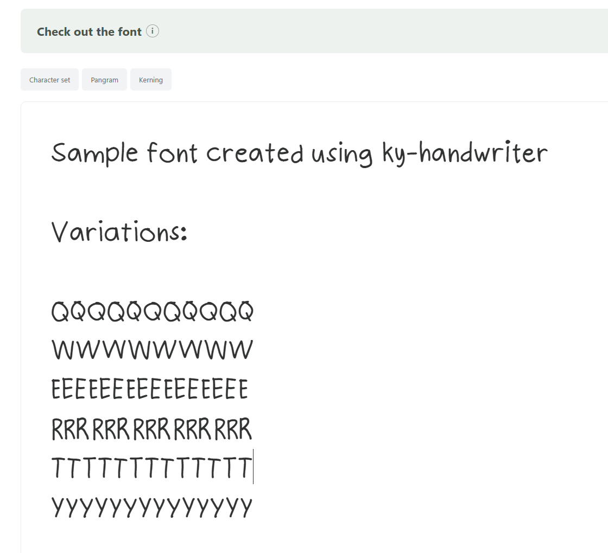
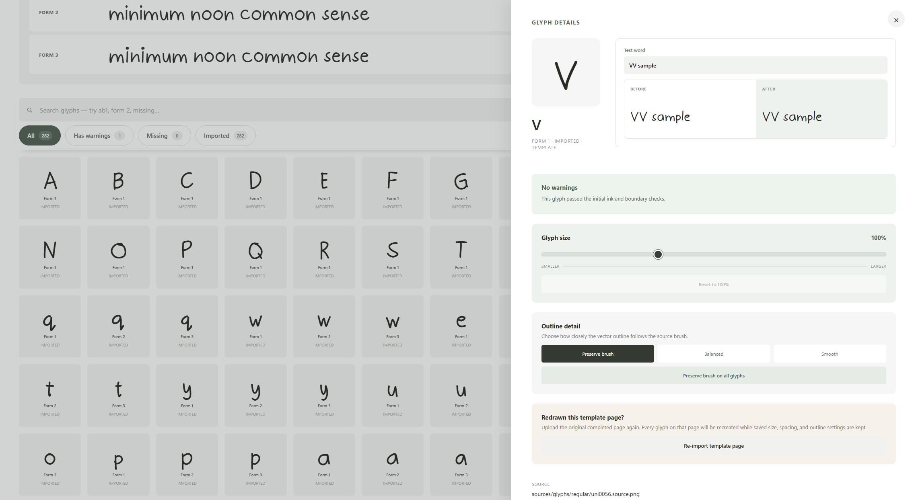
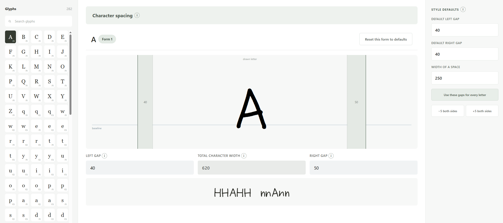
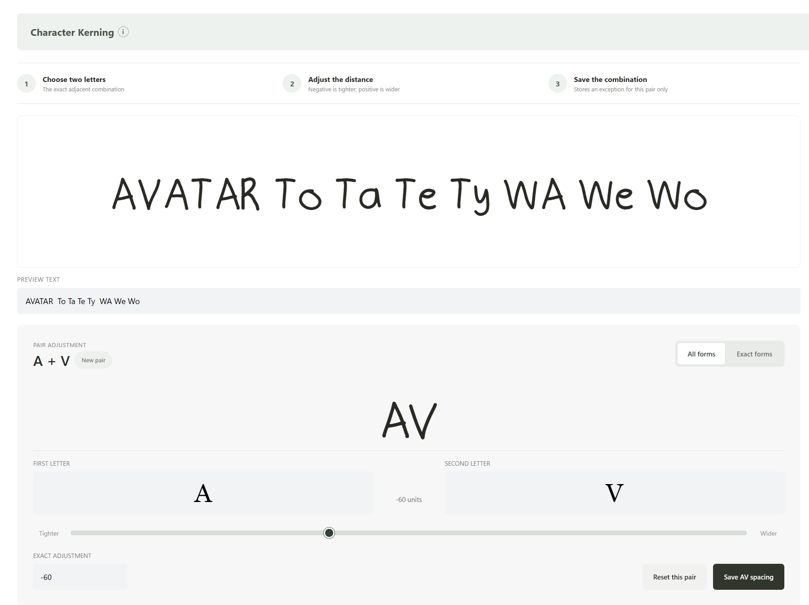

# ky.handwriter

ky.handwriter is a local-first Windows desktop app that turns handwriting into a usable OpenType font. It guides a font from printable handwriting sheets through image extraction, glyph refinement, spacing, kerning, preview, and export.

## Screenshots

### Font preview and alternate forms



### Glyph review and refinement



### Character spacing



### Kerning



## What it does

- Creates self-contained font projects that can be reopened and edited later.
- Generates 300 DPI A4 or US Letter handwriting sheets as PNG and PDF.
- Supports uppercase, lowercase, numbers, keyboard symbols, or the complete US QWERTY character set.
- Captures up to four handwritten forms per character and automatically rotates contextual alternates in the compiled font.
- Imports completed PNG or JPEG sheets, identifies their QR-coded page, extracts each glyph, and flags blank or problematic cells.
- Lets you review glyphs, compare forms, resize outlines, and choose preserved, balanced, or smooth tracing.
- Provides per-glyph side-bearing controls, style-wide spacing defaults, and exact kerning adjustments.
- Builds an in-app font preview so changes can be tested with custom text and sizes before export.
- Exports a desktop TTF, web-ready WOFF2 and CSS, a UFO source archive, SVG outlines, and a validation report.

## Typical workflow

1. Create a font project and choose its local folder.
2. Select a character set, page size, and number of handwritten forms.
3. Generate and print the PNG or PDF handwriting sheets.
4. Fill the sheets in black ink, then scan or photograph them as PNG or JPEG files.
5. Import all completed pages and review missing glyphs or extraction warnings.
6. Refine outline detail and glyph size, then adjust spacing and kerning.
7. Build the font and test it in the live preview.
8. Open the Export view to locate the generated desktop and web font files.

Project data stays in the selected folder. The main files are organized as follows:

```text
project.json                 Saved project settings and glyph metadata
sources/templates/           Blank and completed handwriting sheets
sources/glyphs/regular/      Extracted source images and masks
vectors/regular/             Traced SVG outlines and trace cache
generated/regular/           Compiled fonts, CSS, UFO archive, and report
```

## Development

### Prerequisites

- Node.js and npm
- Rust and Cargo
- Python 3.11 or newer
- Windows tooling required by Tauri 2 (WebView2 and Microsoft C++ Build Tools)

Install the frontend dependencies and create the compiler environment:

```powershell
npm install
python -m venv compiler\.venv
compiler\.venv\Scripts\python.exe -m pip install -r compiler\requirements.txt
```

Validate and run the desktop app:

```powershell
npm run check
npm run tauri dev
```

The Tauri backend starts the Python compiler from `compiler\.venv` during development. The compiler receives one JSON request on standard input and returns one JSON response on standard output.

To check that protocol directly:

```powershell
Set-Location compiler
'{"command":"health-check"}' | .\.venv\Scripts\python.exe -m handfont_compiler
```

Run the compiler tests:

```powershell
Set-Location compiler
.\.venv\Scripts\python.exe -m unittest discover -s tests
```

## Architecture

- **Svelte 5 + TypeScript + Vite** provide the desktop interface and editing workflow.
- **Tauri 2 + Rust** manage local project files, native dialogs, and the compiler process.
- **Python, OpenCV, and Pillow** generate templates and extract handwriting from completed sheets.
- **ufoLib2, ufo2ft, and fontTools** trace glyphs and compile the OpenType deliverables.

The compiler supports health checks, project validation, template generation, template import, replacement sheets, and font compilation through its local JSON protocol.

## Windows release

Install the compiler packaging dependency once:

```powershell
compiler\.venv\Scripts\python.exe -m pip install -r compiler\requirements-build.txt
```

Then build the frontend, frozen compiler, installers, and portable archive:

```powershell
npm run desktop:build
```

Release artifacts are written beneath `src-tauri\target\release`:

- `bundle\nsis\ky.handwriter_<version>_x64-setup.exe`
- `bundle\msi\ky.handwriter_<version>_x64_en-US.msi`
- `ky.handwriter_<version>_x64-portable.zip`

The installer and portable archive include the frozen compiler, so end users do not need Python. Keep the portable archive's extracted contents together because `ky.handwriter.exe` expects its `compiler` subfolder.

## Privacy

Everything runs locally. ky.handwriter has no accounts, remote APIs, analytics, project uploads, or cloud dependency.
